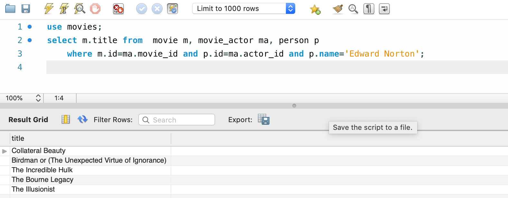

#Assignment 2

## Overview

The second homework is to construct a set of SQL queries for data analysis. For this, we will provide some natural language level query questions that students will need to convert into sql statements.

Students will also be required to run these sql queries and have them checked by the TAs  **{++in class++}**.

This task is an opportunity to:

* Learn basic and certain advanced SQL features
* Get familiar with using and applying sql in specific application scenarios

**Release Date:** March 12, 2021 / 15:25

**Due Date:** March 12, 2021 / 17:10


--------

## Preliminary

#### Download

You need to download the **DataSet** we have prepared for you in the `elearning`.

- `movies.sql`


----

#### Loading data

Open `Mysql Workbench` , click the corresponding tab to import `movies.sql` downloaded in the previous step.


Then click the `run` button (It looks like ⚡️), you'll see a series of success logs below.


Finally, click the refresh button in the sidebar.

A schema called **movies** has been loaded sucessfully.


## Simple tutorials
!!! hint 
    **Before writing SQL statements, please carefully observe the column name and structure of each table. A clearer understanding of the overall architecture will help you quickly and accurately finish this work.**

### Table Structure

* **Genre**

| Column | Type    | Example  |
| ------ | ------- | -------- |
| Id     | Int     | 1        |
| Name   | Varchar | "Action" |

* **movie**

  | Column      | Type               | Example                |
  | ----------- | ------------------ | ---------------------- |
  | Id          | Int                | 1                      |
  | Title       | Varchar            | "(500) Days of Summer" |
  | Description | Varchar            | "Desc"                 |
  | Director    | Int  (person's id) | 123                    |
  | Year        | Int                | 2014                   |
  | Length      | Int                | 95                     |
  | Rating      | Double             | 8.0                    |
  | Votes       | Int                | 9830                   |
  | Revenue     | Double             | 98982.3                |
  | Metascore   | Int                | 76                     |


* **movie_actor**

  **{++A movie can correspond to multiple actors++}**

  | Column   | Type | Example |
  | -------- | ---- | ------- |
  | Id       | Int  | 1       |
  | movie_id | Int  | 1       |
  | actor_id | Int  | 2       |


* **movie_genre**

  **{++A movie can correspond to multiple genres++}**

  | Column   | Type | Example |
  | -------- | ---- | ------- |
  | Id       | Int  | 1       |
  | movie_id | Int  | 1       |
  | genre_id | Int  | 2       |


* **person**

| Column | Type    | Example |
| ------ | ------- | ------- |
| Id     | Int     | 1       |
| Name   | Varchar | "amy"   |


----

### Examples


> ####  **E1**
>
> **查询 `Edward Norton` 参演的所有电影的标题**

```sql
use movies;
select m.title from  movie m, movie_actor ma, person p
	where m.id=ma.movie_id and p.id=ma.actor_id and p.name='Edward Norton';
```



---


> #### **E2**
>
> **查询执导电影超过3部的导演名称**
>
> **输出: 导演名，电影名称**

```sql
use movies;
select p.name, m.title from movie m, person p
		where m.director = p.id and m.director in 
		    (select director from movie group by director having count(*) > 3);
```

----


> #### **E3**
>
> **查询前十位票房担当演员，即该演员参演的所有电影的累积票房最高**
>
> **输出：演员名称，累积票房**

```sql
use movies;
select mm.name, sum(mm.revenue) as sum_revenue from 
	(select p.name as name, m.revenue as revenue  
   		from person p, movie m, movie_actor ma
		where p.id = ma.actor_id and ma.movie_id=m.id ) as mm 
	group by mm.name order by sum_revenue desc limit 10;
```


-----

## Tasks

### Q1

> **查询上映时间 >= 2014年并且评分<=7.0的电影，**
>
> **输出:电影标题，导演姓名，评分(`rating`)**


### Q2

> **查询这样的导演姓名（在`movie`.`director`中有记录的即导演），这些导演没有在任何一部电影中担任演员。**
>
> **输出：导演姓名**


### Q3

> **查询 `Edward Norton` 或者 `Aamir Khan` 参演过的所有电影**
>
> **输出: 电影标题,该电影的上映时间**


### Q4

> **查询类型为 `Action`且 评分>8.0 的电影，并且该电影的导演执导的所有电影>=2部**
>
> **输出:电影标题,导演姓名,评分**


### Q5

> **查询电影，该电影至少包含`Horror`，`Thriller`这2种类型**
>
> **输出：电影名称，导演名称**


### Q6

> **查询电影，该电影仅仅包含`Horror`，`Thriller`这2种类型**
>
> **输出：电影名称，导演名称**


### Q7

> **查询在2014年之前（包括2014），有超过3部电影上映的演员以及他参演的电影名**
>
> **输出: 演员名，参演的电影名，**


### Q8

> **查询演员，该演员参演了`Joss Whedon`导演执导的所有电影。**
>
> **输出：演员姓名**


### Q9

> **查询这样的演员与导演，这个演员参演了该导演执导的所有电影，且该导演导演了至少2部电影。**
>
> **输出： 演员姓名，导演姓名**


### Q10*

!!! Warning "Additional Question"

> **查询每一种类型电影对应的影帝/影后（对于每一种类型，该影帝/影后至少有三部电影是这个类型，并且在所有至少参演了3部该类型电影的演员中，获得的平均评分最高）**
>
> **输出： 类型，演员名，平均评分**


